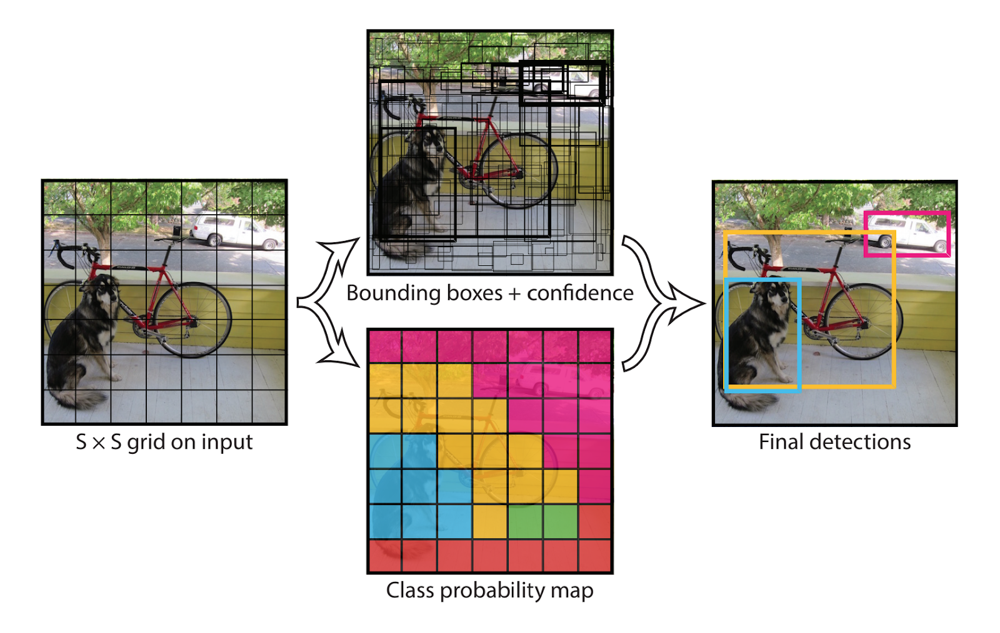
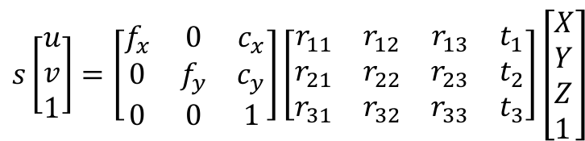
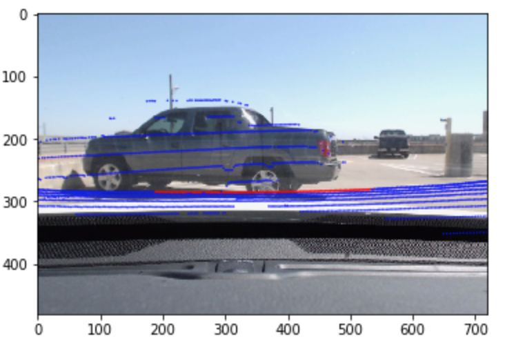

# Collision Prediction System Prototyping

>Collision Prediction with LIDAR and Camera

EE 464H/R Senior Design, Spring 2018 - Team 11

Team Members: Aditya Kharosekar, Chang Park, Evan Reid, Roberto Rioja, Steven Han, Trevor Eggenberger, and [Vivian Tan](https://vivianistan.github.io)

Faculty Mentor: Dr. Joydeep Ghosh

Graduate Student Mentors: Michael Motro and Taewan Kim

Special Thanks: TxDOT (Texas Department of Transportation)

Links:
* [Project Site](https://ut18-senior-design.github.io/Object-Detection-and-Calibrations/#/)
* [Code](https://github.com/UT18-Senior-Design/Object-Detection-and-Calibrations/)

# Description:

This project is a collision warning system prototype that can warn drivers of impending collisions. The Texas Department of Transportation (TxDOT) and CARSTOP research group is interested in developing prototypes of collision warning (CW) systems to improve safety in traffic scenarios such as urban intersections, rural roads, and areas with heavy bicycle and pedestrian traffic. With the rise of autonomous technologies, which are currently secretive and expensive to replicate, we decided to create a collision warning prototype with open source software and lower-cost versions of sensors used in autonomous vehicles. Our system can detect objects and track each one's position in real time using LIDAR and a camera. It uses Kalman filtering and position data from the LIDAR and camera to predict collisions with the host vehicle.

# System Overview

Here is the block diagram of the system: 

  

    

      

        
      

    

  
  

  ## Object Detection:

  To detect objects present in the frame, we are using an object detection algorithm called You Only Look Once ([YOLO](https://pjreddie.com/darknet/yolo/)) which is capable of detecting bounding boxes of objects in real-time. It applies a neural network to the entire image or frame, splitting it into different regions for which it then calculates bounding boxes and probabilities.

  *YOLO Object Detection Overview:*
  

    

      

        
      

    

  
  

  

  ## Lidar-Camera Transformation:

  Our LIDAR-Camera Transformation (LCT) system is used to compare 3D LIDAR points to positions inside of our camera footage. We use a rotation and translation matrix to convert the 3-dimensional point cloud into the 2-dimensional domain of the camera.

   *LIDAR-Camera transform equation:*
   

    

      

        
      

    

  
  
   
  *Illustration of 3D-2D Projection:*
   

    

      

        
      

    

  
  
  
*Image of point cloud overlayed on truck using LCT:*

  

    

      

        
      

    

  
  

  

  We were able to detect a car's distance within 4% error and a person's distance within 2% error.

  The matrices we used were calculated by hand for very specific configurations of the camera and LIDAR positions. 

  ## Collision Prediction

  We used Kalman filtering to predict the trajectory of detected objects.

  # Testing and Results 

  We mainly focused on testing: 

  * LIDAR point cloud collection verification
  * Object position tracking accuracy
  * LIDAR-Camera calibration overall quality

  # Potential future work

  * Increase quality of LIDAR-Camera calibration, which could increase accuracy of position tracking
  * Add functionality for predicting trajectory of multiple objects
  * Integrate more sensors (radar, additional cameras, etc.)
  * Integrate/develop basic V2V communication protocol

  # Miscellaneous
  ## Sensors
  * LIDAR: [Velodyne VLP-16](http://velodynelidar.com/vlp-16.html)
  * Camera: [Logitech c920 1080P HD Webcam](https://www.logitech.com/en-us/product/hd-pro-webcam-c920)
  ## Getting Started:
  Most of the code we used is available on Github, however our modified YOLO code is not uploaded yet.

### To run object detection + tracking: 

1. Make sure your camera and LIDAR are in the correct positions (see calibration for more detail)

2. Run the YOLO code from `/darknet` using 
	
		./darknet detector demo cfg/coco.data cfg/yolo.cfg yolo.weights

3. Then run `python main.py` to run the program

### To check the LIDAR-Camera Matrix transformation:
1. Place your camera and LIDAR in the correct position

2. Run `python lidar_projection.py` to see the lidar projection on a video stream with your calibration matrix

### To capture a point cloud in .csv format:

1. Make sure your LIDAR is conneted
2. Run `python velodyne_capture_v3.py` and your point cloud will be saved as `pcl.csv` by default 

  ## Progression
  ### Apollo:
  Our first approach was to try using [Apollo](https://github.com/ApolloAuto/apollo), an open source autonomous driving platform by Baidu. Though this platform is meant for autonomous driving, we thought we could leverage some of their tools in a collision prediction/warning system. However, Apollo requires very expensive hardware such as the 64-layer Velodyne LIDAR, which we could not get access to. We were able to successfully install Apollo and run Apollo's Dreamview simulator demo, but ran into problems trying to integrate our existing sensors into the system. We posted our issues to their Github, but after several weeks of unsuccessfully trying to integrate our sensors to Apollo, in the interest of time we decided it would be best for us to try other platforms/approaches to creating a collision warning system with our available sensors.

  ### ROS:
  The next platform we tried was using ROS (Robot Operating Systems), a commonly used framework for robot software development. We decided to use ROS because Apollo is built on ROS, so we could try using some of the same software drivers Apollo software uses (such as the Velodyne and camera drivers) to implement a simpler collision warning system. We were able to successfully install ROS Kinetic and the Velodyne drivers on one of our machines. We could use the drivers to print display VLP-16 point clouds using the visualizer. We used [this](https://wiki.ros.org/velodyne/Tutorials/Getting%20Started%20with%20the%20Velodyne%20VLP16) tutorial. However, when we tried to calibrate our camera and LIDAR together, we couldn't get any of the existing ROS drivers to work successfully due to various software/installation issues. 

  ### YOLO + Python:
  Since we couldn't find an existing driver to calibrate our LIDAR and camera, we decided to primarily use [YOLO](https://pjreddie.com/darknet/yolo/) and write our own code in Python to create the system we needed. We use YOLO to detect objects and create bounding boxes for them, while we wrote our own code to calibrate the camera and LIDAR and predict the trajectory of the objects. 

  ## Video Demos:
  * Links coming soon

<!-- 
- [System Overview](overview.md)
- [Getting Started](started.md)
- [Progress Log](log.md)
- [Demos](effects.md) -->

