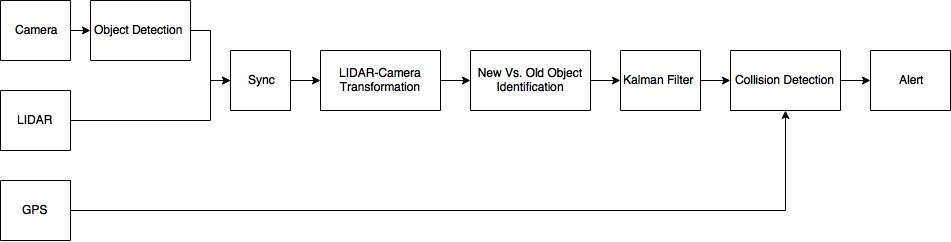

# Overview

  

    

      

        
      

    

  
  
  
### Background Images

## Methods

| Method | Description | 
| --- | --- |
| collectElements | Collects all the targets and saves references inside a collection. |
| extractColorsAndAttachStyles | Extracts color palettes and attaches static styles to each styleTarget. This is where we call onReadyCallback. |
| attachEventListeners | Attaches the event listeners to each `eventTarget` element. |
| detachEventListeners | Detaches the event listeners from each `eventTarget` element. |
| init(options) | Initializes the whole plugin. Can be called only after `palettify` is destroyed. |
| destroy(cleanUp = true) | Destroys the whole plugin and cleans after it self. `cleanUp <Boolean> = true` - If set to false, skips the cleaning part.|
| reInit | Destroys and Initializes the plugin. |
| cleanUp | Cleans up the dof after plugin is destroyed. Removes all `static` styles. |
| setOptions (options, reInit = true) | Allows setting an option after the plugin is initialized. Requires an options object. `reInit <Boolean> = true`  Tells the `palettify` to reinitialize. |
| isInitialized | Check if plugin is initialized. Returns `Boolean`. |

## Options in Data Collection

The palettify instance returns a `data` array that represents a collection of html element references, function references and properties:

| Attribute | Description | 
| --- | --- |
| enterHandler | A reference to the enterEvent handler. This is needed to be able to unbind on the `destroy` method. Don't worry about it |
| leaveHandler | A reference to the leaveEvent handler. Same as above. |
| eventTarget | A reference to the eventTarget element. Used for easy access to each event target. |
| image | A reference to the image/element that is being sampled.|
| styleTarget | A reference to the styleTarget element. |
| palette | A collection of different palettes. See bellow |
| palette.original | The original palette extracted from the image. An Array of Arrays containing the RGB colors as indexes. |
| palette.rgb | An array of RGBA strings `rgba(255,255,255, 1)` from the `original` palette with set opacity to 1 .|
| palette.rgba | An array of RGBA strings `rgba(255,255,255, 0.5)` from the `original` palette, opacity is influenced by the `opacities` option.|
| palette.contrastColors | An array of the `contrastColors`, depending on the luminosity of each color a proper contrast color is chosen. |
